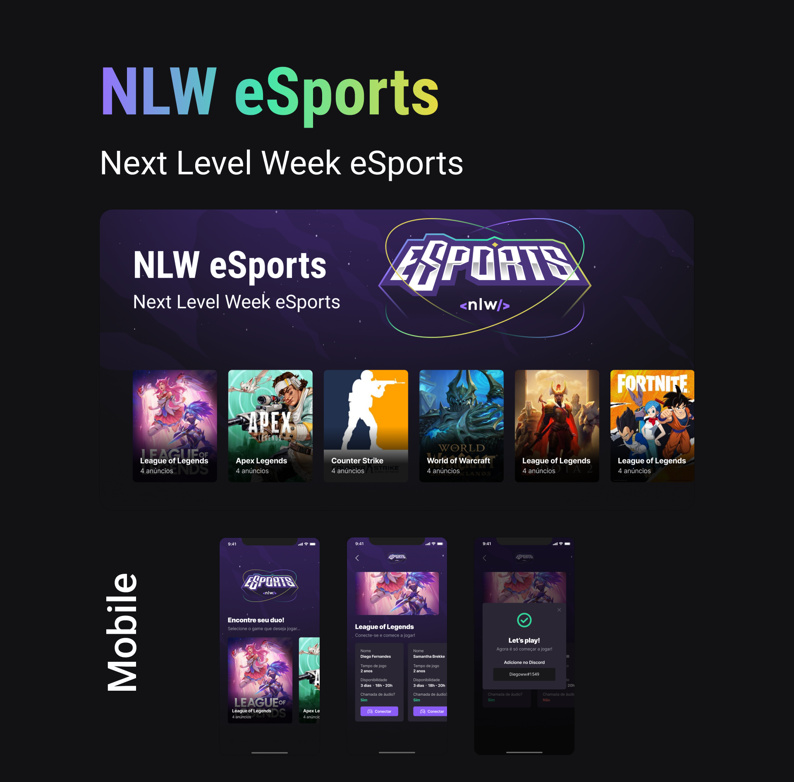
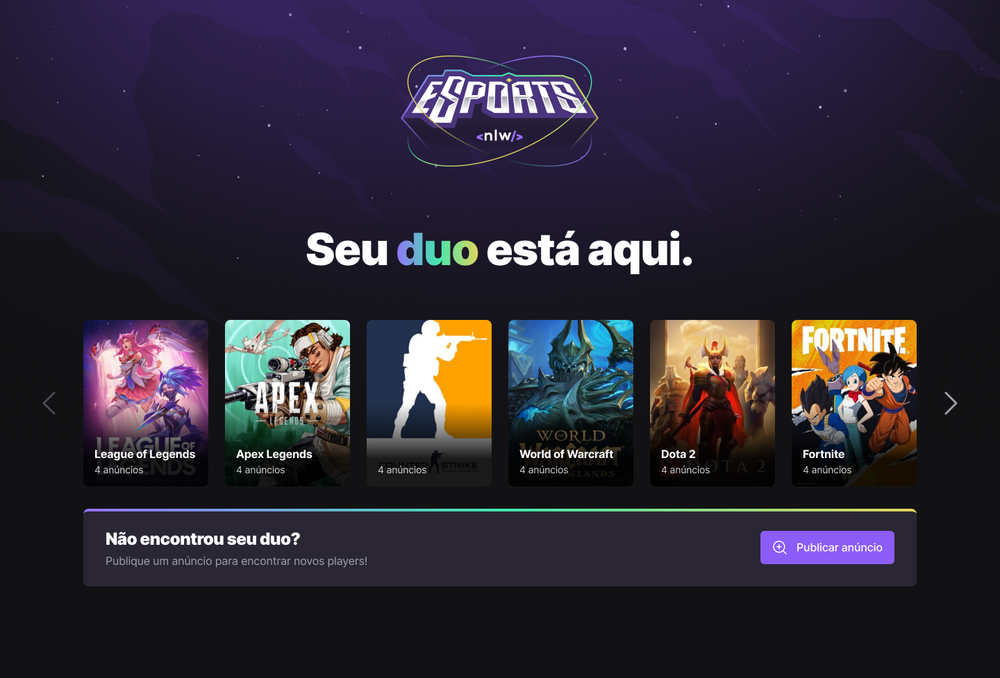
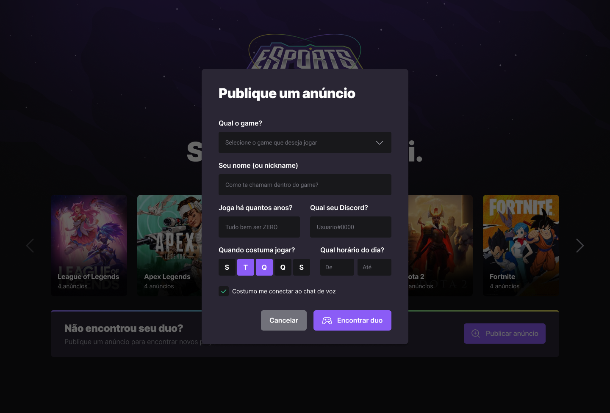
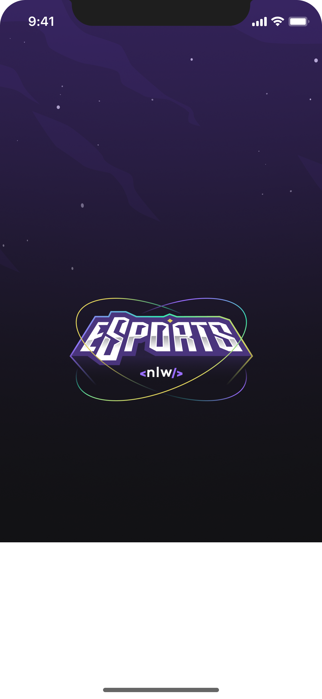
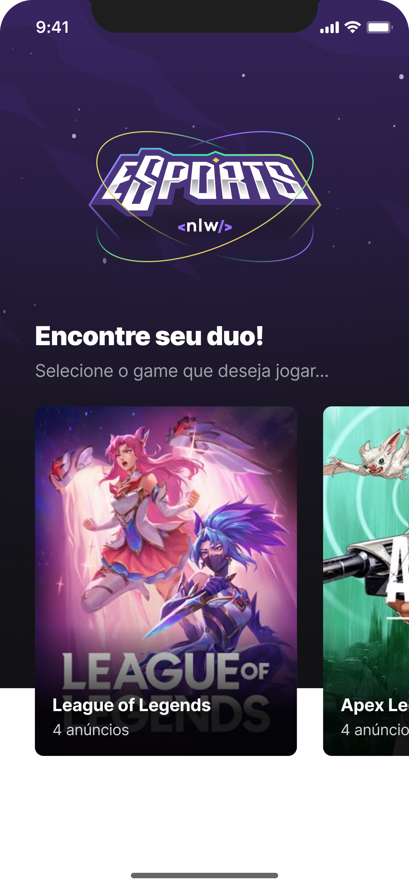
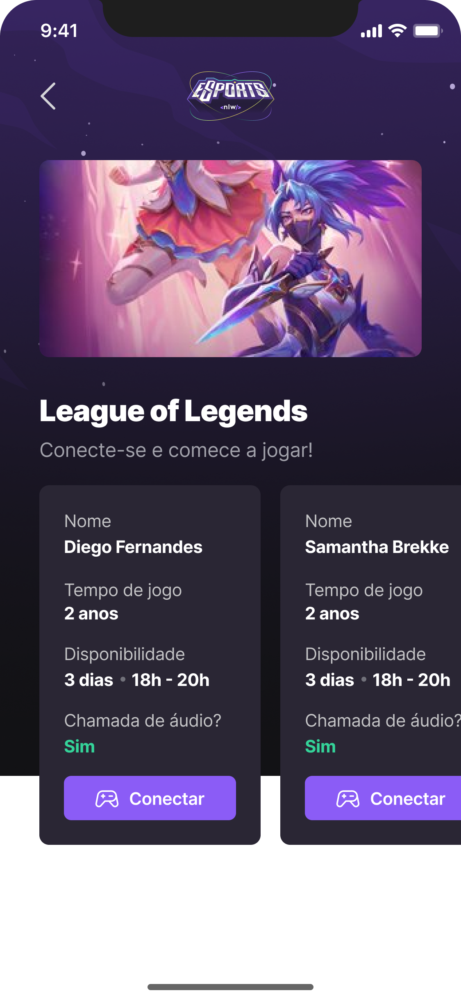
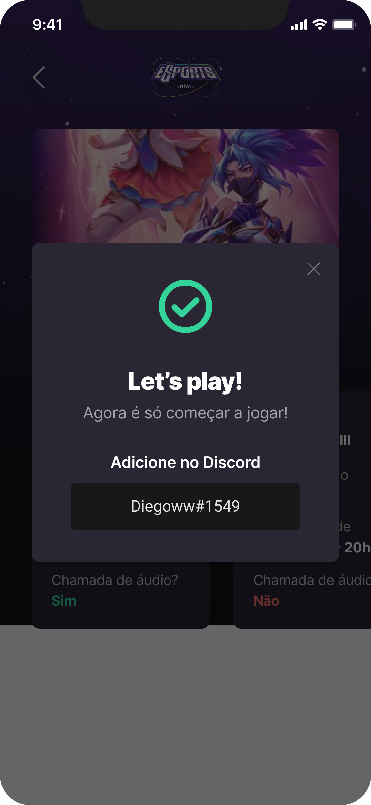

<h1 align="center" id="nlw_esports">
  
</h1>

<!-- Description -->
<!-- Pequena descrição do projeto. -->

<p align="center"></p>

<!-- Badges -->
<!--
Aqui peguei como base repo do React(https://github.com/facebook/react) para setar as badges.
Para mais Badges, acesse: https://shields.io/
-->
<p align="center">
  <!-- GitHub last commit -->
  <a href="">
    
  </a>
  <!-- GitHub language count -->
  
  <!-- GitHub top language -->
  
  <!-- Repository size -->
  
  <!-- Repository status -->
  
  <!-- Contribution -->
  
  <!-- Link repo -->
  <a href="link repo">
    
  </a>
</p>

<!-- Table content -->
<!-- Adicione seus tópicos, ex: -->
<p align="center">
 <a href="#about">Sobre</a> •
 <a href="#layout">Layout</a> • 
 <a href="#technologies">Tecnologias</a> • 
 <a href="#prerequisites">Pré-requisitos</a> •
 <a href="#contributors">Contribuidores</a> • 
 <a href="#author">Autor</a> • 
 <a href="#license">Licença</a>
</p>

<!-- main image -->
<p align="center">
  <!-- Link externo ou local(.github). -->
  
</p>

<!-- Project Status -->
<h4 align="center">
  	🚧 NLW - eSports | Concluído 🚧
</h4>

<!-- Description 2 -->
<!-- Descreva seu projeto. -->
<h2 id="about">
💻 Sobre o projeto
</h2>

NLW eSports foi um projeto em que desenvolvemos durante um bootcamp ministrado pela [Rocketseat](https://www.rocketseat.com.br/) durante uma semana, onde codamos a versão Web, Mobile e o backend. O projeto é voltado pra quem gosta de jogar jogos online e está em busca de um duo (dupla/parceiro). Na plataforma você faz um anúncio sobre qual jogo você quer encontrar um duo, e outro usuário lhe encontrará e assim vocês podem se conectar através do [Discord](https://discord.com/).

<!-- Layout -->
<!-- Substitua pelo link do layout no Figma (https://www.figma.com) -->
<h2 id="layout">🎨 Layout</h2>
O layout da aplicação está disponível no Figma:
<br /><br />
<a href="https://www.figma.com/community/file/1150897317533332617">
  
</a>
<br /><br />

<h4 id="layout_web">Web</h4>
<p align="left" style="display: flex; align-items: flex-start; justify-content: center; gap: 16px;">
  

  

</p>

<h4 id="layout_mobile">Mobile</h4>
<p align="left" style="display: flex; align-items: flex-start; justify-content: center; gap: 16px;">
  

  

   

   

</p>

<!-- Technologies -->
<!-- [nome_da_tech](https://exemplo.com)-->
<br />
<h2 id="technologies">🛠 Tecnologias</h2>

As seguintes ferramentas foram usadas na construção do projeto:

- **[TypeScript](https://www.typescriptlang.org/)**
- **[React Native](https://reactnative.dev/)** + **[Expo](https://expo.dev/)**
- **[NodeJs](https://nodejs.org/en/)**
- **[Prisma](https://www.prisma.io/)**
- **[SQLite](https://www.sqlite.org/index.html)**
- **[React](https://reactjs.org/)** + **[Vite](https://vitejs.dev/)**
- **[Tailwindcss](https://tailwindcss.com/)**
- **[Radix UI](https://www.radix-ui.com/)**

**Utilitários**

- Editor: **[Visual Studio Code](https://code.visualstudio.com/)**
- Ícones: **[Phosphor icons](https://phosphoricons.com/)**
- Fontes: **[Inter](https://fonts.google.com/specimen/Inter?query=Inter)**

<!-- Prerequisites -->
<h2 id="prerequisites">💿 Como executar o projeto</h2>

### 🧰 Pré-requisitos

Antes de começar, você vai precisar ter instalado em sua máquina as seguintes ferramentas:

> [Git](https://git-scm.com), [Node.js](https://nodejs.org/en/) ou [Yarn](https://yarnpkg.com/) se for sua preferência.
> Além disto é bom ter um editor para trabalhar com o código como [VSCode](https://code.visualstudio.com/)

### 🧭 Rodando o projeto

```bash
# Clone este repositório
$ git clone https://github.com/erik-albuquerque/nlw-esports

# Acesse a pasta do projeto no terminal/cmd
$ cd nlw-esports

# Instale as dependências de cada repo (npm ou yarn)

# server 
$ cd nlw-esports/server
$ yarn

# web
$ cd nlw-esports/web
$ yarn

# mobile
$ cd nlw-esports/mobile
$ yarn

# Execute cada aplicação separadamente em modo de desenvolvimento
$ yarn dev

# Para executar o mobile, recomendo rodar com npx
$ npx expo start --tunnel

```

 <!-- Contributors -->
<h2 id="contributors">📫 Como contribuir para o projeto</h2>

1.  Faça um **fork** do projeto.
2.  Crie um branch: `git checkout -b <nome_branch>`.
3.  Faça suas alterações e confirme-as: `git commit -m '<mensagem_commit>'`.
4.  Envie para a branch original: `git push origin <nome_branch>`.
5.  Crie a solicitação pull.

> Como alternativa, consulte a documentação do GitHub em [como criar uma solicitação pull](https://help.github.com/en/github/collaborating-with-issues-and-pull-requests/creating-a-pull-request)

## 👨‍💻 Contribuidores

Agradecemos às seguintes pessoas que contribuíram para este projeto:

<!--
Se você já tem experiência, use o bot para automatizar esse processo.
https://allcontributors.org/docs/en/bot/overview
-->
<table>
  <tr>
    <td align="center">
      ...
    </td>
  </tr>
</table>

### 🙋‍♂️ Seja um dos contribuidores

Quer fazer parte desse projeto? Clique [AQUI](CONTRIBUTING.md) e leia como contribuir.

<!-- Author -->
<!-- Link do avatar do seu GitHub. -->
<h2 id="author">🦸 Autor</h2>
<a href="https://github.com/erik-albuquerque">
<!-- Link externo ou local(.github). -->
 "/>
 <br />
 <sub><b>Érik Albuquerque</b></sub></a>

[](https://www.linkedin.com/in/erik-albuquerque/)
[](mailto:erik.albuquerque.oficial@gmail.com)

<!-- License -->
<!-- Crie a licença quando inciar seu projeto. -->
<h2 id="license">📝 Licença</h2>

Distribuído sob a licença MIT. Veja a [LICENSE](LICENSE) para mais informações.

Feito com ❤️ por Érik Albuquerque 👋🏽 [Entre em contato!](https://www.linkedin.com/in/erik-albuquerque/)

<!-- Back to top -->

[⬆ Voltar ao topo](#nlw_esports)<br />
